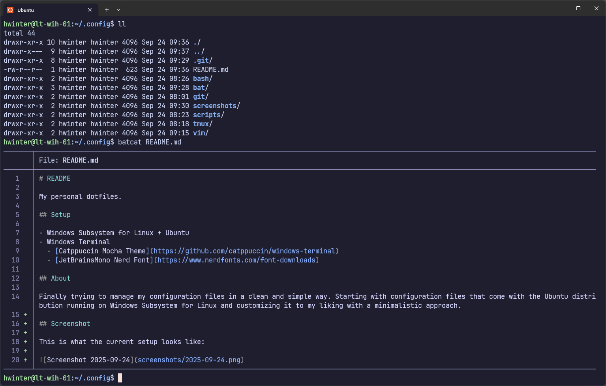

# README

My personal dotfiles.

## Setup

- Windows Subsystem for Linux + Ubuntu
- Windows Terminal
  - [Catppuccin Mocha Theme](https://github.com/catppuccin/windows-terminal)
  - [JetBrainsMono Nerd Font](https://www.nerdfonts.com/font-downloads)

## About

Finally trying to manage my configuration files in a clean and simple way. Starting with configuration files that come with the Ubuntu distribution running on Windows Subsystem for Linux and customizing it to my liking with a minimalistic approach.

## Screenshot

This is what the current setup looks like:

