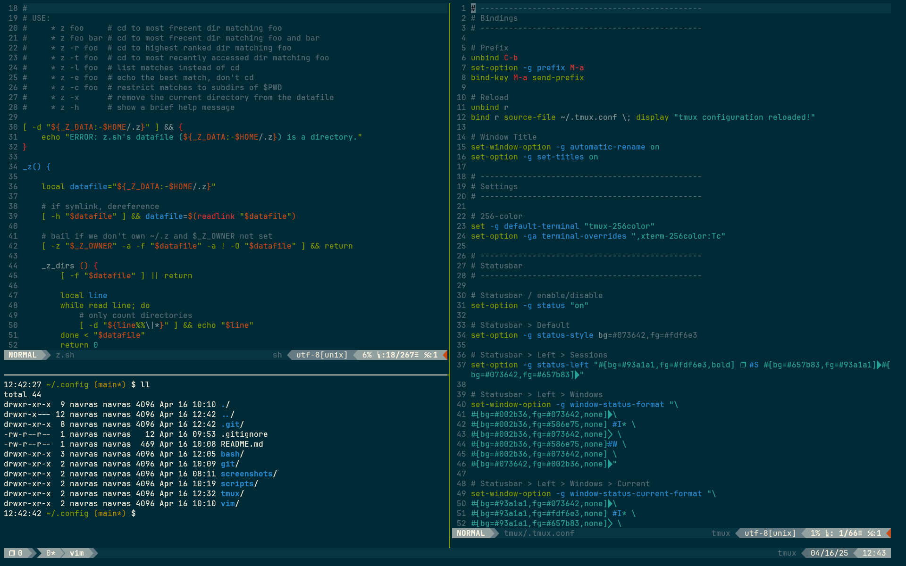

# dotfiles

## Description

This is the git repository for my personal dotfiles for bash, vim, git and tmux.

## Windows Subsystem for Linux

- Windows 11 + Windows Subsystem for Linux 2 + Ubuntu
- Windows Terminal App
- Font: [JetBrainsMono Nerd Font](https://github.com/ryanoasis/nerd-fonts/releases/download/v3.3.0/JetBrainsMono.zip)
- Colorscheme: [Solarized Dark Patched for Windows Terminal](https://github.com/Lucky-Loek/patched-solarized-dark-windows-terminal)

## Screenshot

