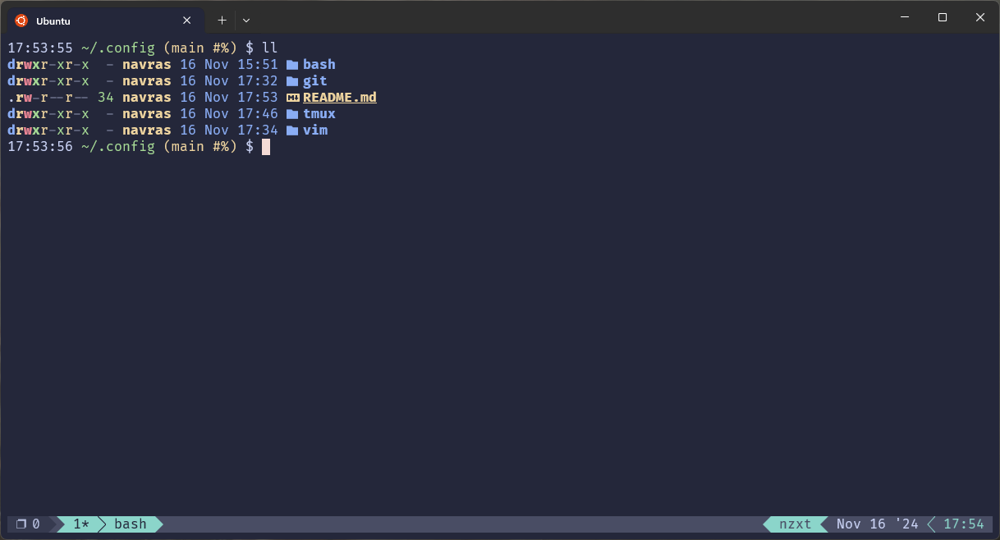

# Dotfiles

My personal dotfiles.

## Windows Subystem for Linux & Ubuntu Desktop

- [Windows Subsystem for Linux](https://learn.microsoft.com/de-de/windows/wsl/)
- [Windows Terminal](https://github.com/microsoft/terminal)
  - [Catppuccin for Windows Terminal](https://github.com/catppuccin/windows-terminal)
  - [Fira Code Nerd Font](https://github.com/ryanoasis/nerd-fonts/releases/download/v3.2.1/FiraCode.zip)
- [Ubuntu Desktop](https://ubuntu.com/desktop/wsl)
- Bash
  - [eza](https://github.com/eza-community/eza) - Modern `ls` Replacement
  - [z](https://github.com/rupa/z) - Jump Around
  - [fzf](https://github.com/junegunn/fzf) - Fuzzy Finder
- [Vim](https://www.vim.org/) - Text Editor
  - [Catppuccin for Vim](https://github.com/catppuccin/vim)
  - [Lightline](https://github.com/itchyny/lightline.vim)
- [Tmux](https://github.com/tmux/tmux/wiki) - Terminal Multiplexer
