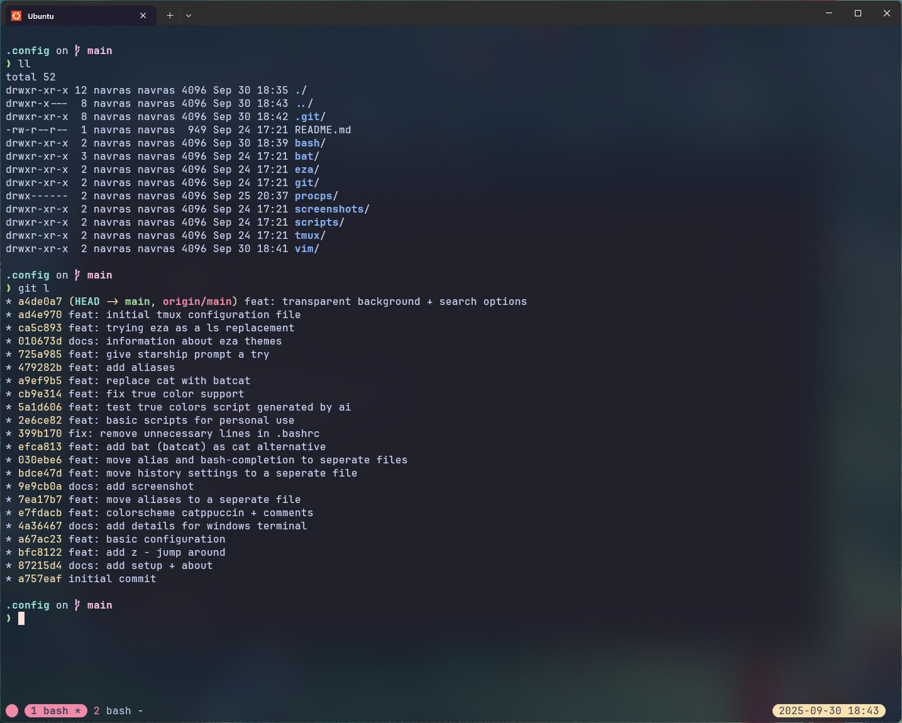

# README

My personal dotfiles.

## Setup

- Windows Subsystem for Linux + Ubuntu
- Windows Terminal
  - [Catppuccin Mocha Theme](https://github.com/catppuccin/windows-terminal)
  - [JetBrainsMono Nerd Font](https://www.nerdfonts.com/font-downloads)

## About

Finally trying to manage my configuration files in a clean and simple way. Starting with configuration files that come with the Ubuntu distribution running on Windows Subsystem for Linux and customizing it to my liking with a minimalistic approach.

## Screenshot

This is what the current setup looks like:



## Notes

Themes in eza will only work in versions >= 0.19.0. For Ubuntu we can install the latest version with this:

```
wget -qO eza.tar.gz https://github.com/eza-community/eza/releases/latest/download/eza_x86_64-unknown-linux-gnu.tar.gz
sudo tar xf eza.tar.gz --strip-components=1 -C /usr/local/bin
rm -rf eza.tar.gz
```
